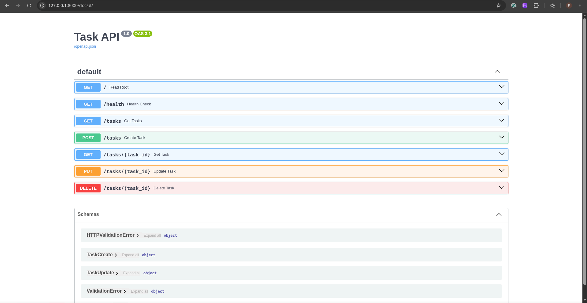

# Task Management API (BE-01)

A clean, RESTful CRUD API built with FastAPI and Python.

---

## 🛠️ Tech Stack

- **Language:** Python 3.10+
- **Framework:** FastAPI
- **ASGI Web Server:** Uvicorn
- **Data Validation:** Pydantic
- **Documentation:** Swagger UI / OpenAPI (built-in at `/docs`)

---

## 🚀 Quick Start

### 1. Clone & Set Up Environment

```bash
git clone https://github.com/your-username/flyrank-todo-api.git
cd flyrank-todo-api

# Create and activate virtual environment
python3 -m venv venv
source venv/bin/activate  # On Windows: venv\Scripts\activate

# Install dependencies
pip install "fastapi[standard]"
```

### 2. Run Command

Start the development server with live reload:

```bash
uvicorn main:app --reload
```

The server will start listening at `http://localhost:8000`.

---

##  Endpoint Table

| HTTP Method | Path | Summary | Expected Status |
| :--- | :--- | :--- | :--- |
| **GET** | `/` | API details | `200 OK` |
| **GET** | `/health` | Server status | `200 OK` |
| **GET** | `/tasks` | List all tasks | `200 OK` |
| **GET** | `/tasks/{id}` | Get single task | `200 OK` / `404 Not Found` |
| **POST** | `/tasks` | Create task | `201 Created` / `400 Bad Request` |
| **PUT** | `/tasks/{id}` | Update task | `200 OK` / `400 Bad Request` / `404 Not Found` |
| **DELETE** | `/tasks/{id}` | Remove task | `204 No Content` / `404 Not Found` |

---

##  Sample `curl` Output

Below is a sample output from querying a single task using `curl -i http://localhost:8000/tasks/1`:

```http
HTTP/1.1 200 OK
date: Sat, 25 Jul 2026 15:30:00 GMT
server: uvicorn
content-length: 63
content-type: application/json

{"id":1,"title":"Setup development environment","done":true}
```

---

## Interactive Swagger UI

FastAPI automatically generates interactive API documentation powered by OpenAPI.

Visit **[http://localhost:8000/docs](http://localhost:8000/docs)** in your browser to inspect and test all CRUD endpoints interactively.



