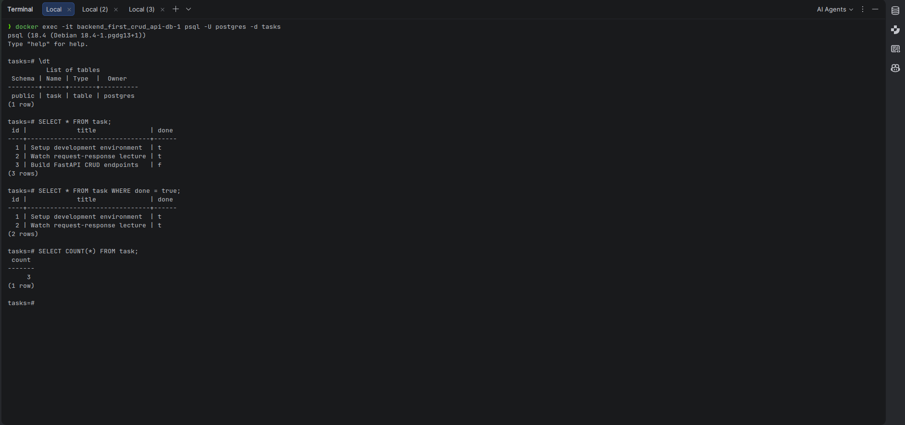
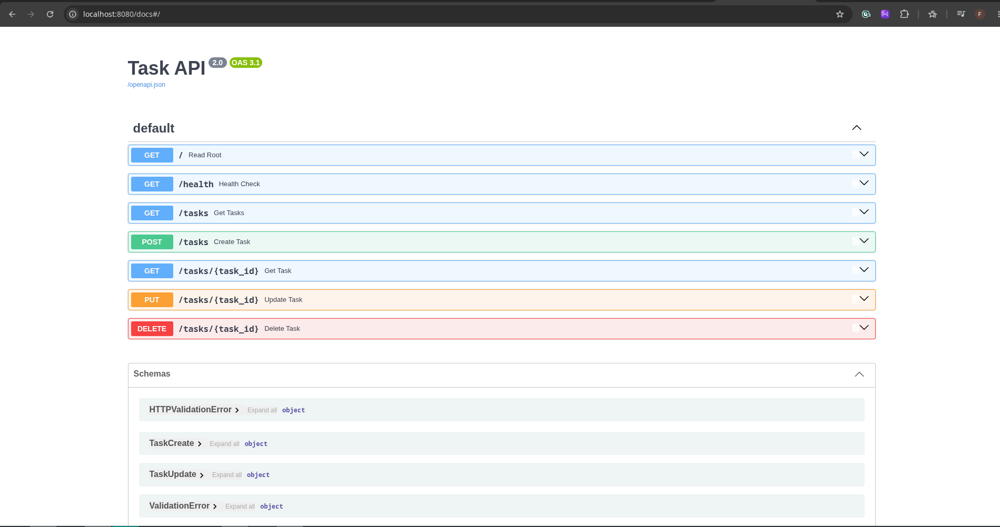
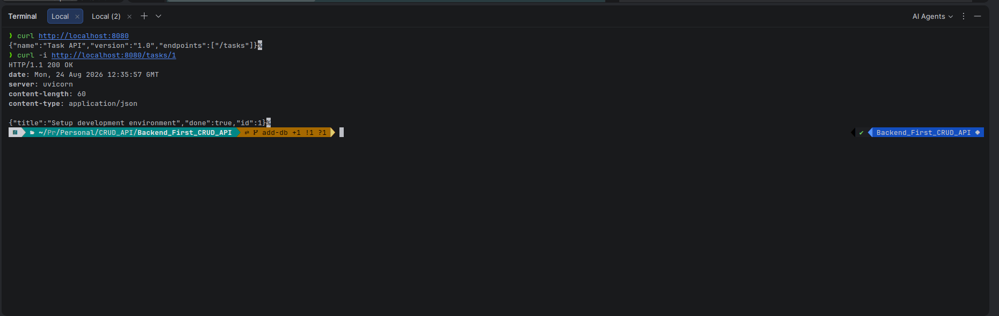

# Task Management API (BE-04)

A containerized, production-ready RESTful CRUD API built with FastAPI, SQLModel, PostgreSQL, and Docker Compose.

---
## Tech Stack

- **Language:** Python 3.10+
- **Framework:** FastAPI
- **ORM / Data Layer:** SQLModel (SQLAlchemy + Pydantic)
- **Database:** PostgreSQL (running containerized)
- **Database Driver:** `psycopg` (binary)
- **Containerization & Orchestration:** Docker & Docker Compose[cite: 2]
- **Configuration & Secrets:** `python-dotenv` via `.env`[cite: 2]
- **Documentation:** Swagger UI / OpenAPI (built-in at `/docs`)

---

## Database & Container Architecture

This assignment marks the third storage iteration of this project: **In-Memory (BE-01) → SQLite (BE-02) → Containerized PostgreSQL (BE-04)**[cite: 2].

### Key Architectural Highlights
- **Storage Decoupling:** Because of clean data layering, swapping SQLite for PostgreSQL required zero changes to API route definitions and endpoint logic[cite: 2].
- **Data Persistence:** PostgreSQL runs inside a dedicated Docker container[cite: 2]. A named Docker volume (`taskdata`) is mounted to `/var/lib/postgresql/data` to ensure all task data persists across container restarts (`docker compose down` followed by `docker compose up`)[cite: 2].
- **Secrets Management:** Sensitive credentials are kept out of source control using `.env` (git-ignored)[cite: 2]. A template `.env.example` file is committed to track required environment keys[cite: 2].
- **Single-Command Stack:** Docker Compose coordinates both the FastAPI service (`api`) and PostgreSQL database (`db`) on an isolated container network[cite: 2].

---

## Quick Start (One-Command Stack)

### 1. Clone & Configure Secrets

```bash
git clone [https://github.com/your-username/Backend_First_CRUD_API.git](https://github.com/your-username/Backend_First_CRUD_API.git)
cd Backend_First_CRUD_API

# Copy template environment variables
cp .env.example .env

---
```

### 2. Launch the Stack
Start both the API container and the PostgreSQL database container with one command

```bash
docker compose up
```

The server will automatically wait for the database, run table migrations/seeding, and start listening at http://localhost:8000

To stop the stack while preserving database contents:
```bash
docker compose down
```
---

##  Endpoint Table

| HTTP Method | Path | Summary | Expected Status |
|---|---|---|---|
| GET | `/` | API details | 200 OK |
| GET | `/health` | Server status | 200 OK |
| GET | `/tasks` | List all tasks | 200 OK |
| GET | `/tasks/{id}` | Get single task | 200 OK / 404 Not Found |
| POST | `/tasks` | Create task | 201 Created / 400 Bad Request |
| PUT | `/tasks/{id}` | Update task | 200 OK / 400 Bad Request / 404 Not Found |
| DELETE | `/tasks/{id}` | Remove task | 204 No Content / 404 Not Found |

---

## Application Screenshots

### Data in the database


### Interactive Swagger UI


### Curl Output



Visit http://localhost:8000/docs in your browser to inspect and test all CRUD endpoints interactively.

---

##  Sample curl Output

Below is a sample output from querying a single task using `curl -i http://localhost:8000/tasks/1`:

```http
HTTP/1.1 200 OK
date: Tue, 11 Augv 2026 09:30:00 GMT
server: uvicorn
content-length: 63
content-type: application/json

{"id":1,"title":"Setup development environment","done":true}
```
