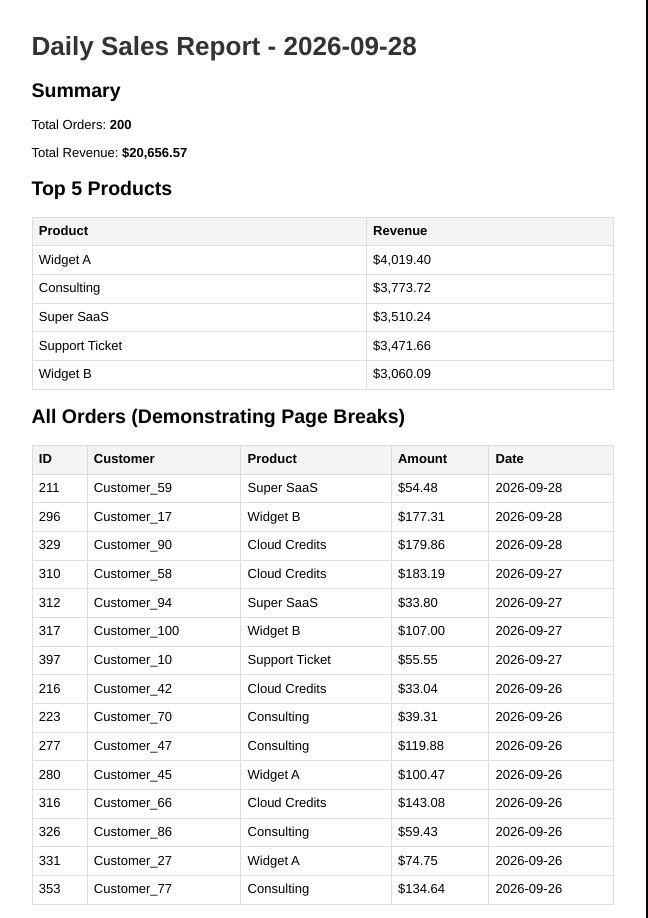

# PDF Report Generator Pipeline

A complete data-to-document pipeline that aggregates database records, renders them into an HTML template, generates a PDF using a headless browser, and serves the file via a secure link.

The architecture enforces strict artifact handling: potentially large binary files remain on disk, while the JSON API only passes lightweight references to those files.

## Dataset

### Option A: The Little Shop

The system uses a built-in SQLite database (`report.db`) containing an `orders` table.

Upon server startup, an idempotent seed script safely clears the table and generates exactly **200 random e-commerce transactions** containing:

- Customer names
- Products
- Transaction amounts
- Order dates

This provides a deterministic dataset size while still allowing the report-generation pipeline to demonstrate realistic aggregation and rendering.

## Quick Start

### 1. Install dependencies

```bash
pip install fastapi uvicorn playwright
playwright install chromium
```

### 2. Start the server

The database is automatically seeded when the server starts.

```bash
uvicorn main:app --reload
```

The API will be available at:

```text
http://localhost:8000
```

### 3. Generate a report

Send a `POST` request to the reports endpoint:

```bash
curl -i -X POST http://localhost:8000/reports
```

Example response:

```json
{
  "id": "c5b1b4a2-8924-4d8e-90f1-4321abcd9876",
  "file": "/reports/c5b1b4a2-8924-4d8e-90f1-4321abcd9876/file"
}
```

### 4. Download the generated artifact

Use the report ID returned by the API:

```bash
curl -o my-report.pdf \
  http://localhost:8000/reports/<report_id>/file
```

The generated PDF is stored on disk rather than being embedded directly inside the JSON response.

---

## Aggregation SQL

Nobody needs to read 200 raw database rows to understand the business data.

The pipeline first aggregates the raw records into meaningful business metrics before rendering the report.

### Total Orders & Revenue

```sql
SELECT
    COUNT(*) AS count,
    SUM(amount) AS revenue
FROM orders;
```

### Top 5 Products by Revenue

```sql
SELECT
    product,
    SUM(amount) AS revenue
FROM orders
GROUP BY product
ORDER BY revenue DESC
LIMIT 5;
```

### Orders Over the Last 7 Days

```sql
SELECT
    created_at,
    COUNT(*) AS count
FROM orders
WHERE created_at >= date('now', '-7 days')
GROUP BY created_at
ORDER BY created_at;
```

### Raw Dataset for the Document Body

```sql
SELECT *
FROM orders
ORDER BY created_at DESC;
```

The resulting data is passed to the HTML template, which is then rendered to PDF using a headless Chromium browser.

---

## Pipeline Architecture

The report-generation flow can be summarized as:

```text
SQLite Database
      │
      ▼
Aggregation Queries
      │
      ▼
Report Data
      │
      ▼
HTML Template
      │
      ▼
Headless Chromium
      │
      ▼
PDF Artifact on Disk
      │
      ▼
Secure File Endpoint
      │
      ▼
Client Downloads PDF
```

A key architectural principle is that the API does not transport the binary PDF inside the JSON response.

Instead, the API returns a lightweight reference:

```json
{
  "id": "report-id",
  "file": "/reports/report-id/file"
}
```

The client can then retrieve the actual artifact through the file endpoint.

---

## Architectural Decisions

### 1. Synchronous Generation Limitations

The initial implementation generates the PDF synchronously inside the HTTP request.

This is simple and appropriate for a small system, but it means the client must wait while the following operations complete:

1. Database queries
2. Data aggregation
3. HTML rendering
4. Chromium startup
5. PDF generation
6. File persistence

If PDF generation takes several seconds, the HTTP request remains open for the entire duration.

For a production system, I would move PDF generation into an asynchronous background worker once:

- Report generation consistently takes more than a few seconds.
- Multiple users need to generate reports concurrently.
- PDF generation consumes significant CPU or memory.
- The API needs to remain responsive under load.

Possible implementations include:

- Celery
- Redis + a worker process
- RabbitMQ + a worker
- Inngest
- A cloud-native job/queue system

The API could then return a job/report identifier immediately while the worker generates the artifact independently.

---

### 2. Idempotency Guarantees

The `POST /reports` endpoint implements an idempotency check.

If a report has already been generated for the current day, the endpoint returns the existing report instead of unnecessarily generating another PDF.

This prevents repeated requests from wasting:

- CPU
- Memory
- Browser startup time
- Disk storage

For example, accidentally clicking a "Generate Report" button twice should not necessarily result in two identical reports being generated.

A similar principle is important in financial systems.

For example, an API endpoint such as:

```text
POST /invoices/{id}/process
```

should be designed carefully so that a retry or duplicate request does not accidentally perform the same financial operation twice.

Idempotency is particularly important when requests can be retried because of:

- Network failures
- Client retries
- Browser double-clicks
- Load balancer retries
- Worker retries
- Timeout ambiguity

---

## Proof of Execution

### 1. Double-Click Idempotency Proof

Firing two rapid `POST` requests results in the same report being returned rather than generating a second report.

First request:

```bash
$ curl -i -X POST http://localhost:8000/reports

HTTP/1.1 201 Created

{
  "id": "c5b1b4a2-8924-4d8e-90f1-4321abcd9876",
  "file": "/reports/c5b1b4a2-8924-4d8e-90f1-4321abcd9876/file"
}
```

Second request:

```bash
$ curl -i -X POST http://localhost:8000/reports

HTTP/1.1 201 Created

{
  "id": "c5b1b4a2-8924-4d8e-90f1-4321abcd9876",
  "file": "/reports/c5b1b4a2-8924-4d8e-90f1-4321abcd9876/file",
  "message": "Cached version"
}
```

The important observation is that both requests reference the same report ID:

```text
c5b1b4a2-8924-4d8e-90f1-4321abcd9876
```

This demonstrates that the second request reused the existing artifact.

---

### 2. Download Proof

The generated PDF can be retrieved using the file endpoint:

```bash
$ curl -o sales_report.pdf \
  http://localhost:8000/reports/c5b1b4a2-8924-4d8e-90f1-4321abcd9876/file
```

Example transfer:

```text
% Total    % Received % Xferd  Average Speed   Time    Time     Time  Current
                                 Dload  Upload   Total   Spent    Left  Speed
100 45.2k  100 45.2k    0     0  2.1M      0 --:--:-- --:--:-- --:--:--  2.1M
```

The resulting file is:

```text
sales_report.pdf
```

---

## Artifacts

### Generated PDF

The screenshot demonstrate that:

- The HTML template rendered correctly.
- Tables fit within the page.
- Print CSS is being applied.
- Headers and report sections are correctly formatted.
- The generated document is readable.

Example:

```markdown

```
---

## Technologies

- **Python**
- **FastAPI** — HTTP API
- **SQLite** — Local database
- **SQL** — Data aggregation
- **HTML/CSS** — Report presentation
- **Playwright** — Headless browser automation
- **Chromium** — PDF rendering
- **Uvicorn** — ASGI server

---

## Key Engineering Concepts Demonstrated

This project demonstrates several practical backend engineering concepts:

- Database aggregation
- SQL reporting queries
- REST API design
- Artifact generation
- HTML-to-PDF rendering
- Headless browser automation
- File-based artifact storage
- Secure artifact retrieval
- Idempotent API operations
- Separation of metadata from binary data
- Synchronous vs. asynchronous processing
- Git artifact management